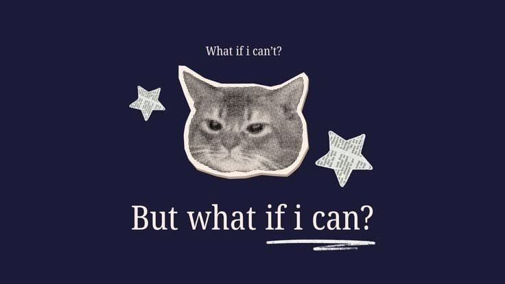

<!-- ==================================================================
  PROFILE README for github.com/leonkrm
  1) Repo must be PUBLIC and named exactly: leonkrm
  2) Upload README.md AND the folder "assets" (with both images) to it
  3) Replace everything in [BRACKETS]
  Alternative banner (white background): assets/banner-obsession.jpg
================================================================== -->

<p align="center">
  
</p>

<h1 align="center">Hi, I'm Leon 👋</h1>

<p align="center">
  <b>High-Load Information Systems &amp; AI</b> · KazNU · Almaty
</p>

<p align="center">
  <a href="https://git.io/typing-svg">
    
  </a>
</p>

<p align="center">
  <a href="[https://www.linkedin.com/in/ruslan-kerimbekov/?lipi=urn%3Ali%3Apage%3Ad_flagship3_profile_view_base_contact_details%3BEt6swIRnT3Giy1cykucTOw%3D%3D]"></a>
  <a href="https://t.me/[insomeli]"></a>
  <a href="mailto:[leonx.kerimbekov@gmail.com]"></a>
</p>

---

## 👋 About me

I'm a **3rd-year student at Al-Farabi Kazakh National University** (Faculty of Information Technology and Artificial Intelligence), specializing in **high-load information systems with AI**.

I build **backend services** with Python / Django and C# / .NET, and I explore **computer vision** and **distributed systems**.

### 🔥 What drives me

> **Obsession beats talent.**
> I don't wait to feel ready: I ship small things, break them, fix them and repeat.

### 🧭 At a glance

```js
const leon = {
  role:       "3rd-year student @ KazNU — High-Load Information Systems with AI",
  location:   "Almaty, Kazakhstan",
  focus:      ["Backend (Python/Django, C#/.NET)", "Computer Vision", "Distributed Systems"],
  principles: ["Real projects, not tutorial apps", "First solve the problem, then write the code"],
  openTo:     ["internship", "junior backend", "collaboration"],
};
```

---

## ⚡ Right now

- 🔭 **Working on:** Object Detector: object detection with OpenCV and YOLO
- 🌱 **Learning:** Akka.NET, F#, OpenCV, YOLO, Docker
- 💬 **Ask me about:** Python, Django, C# / .NET, OpenCV
- 🎓 **Studying:** high-load information systems with AI at KazNU
- 🐧 **Fun fact:** I moved from Ubuntu to Fedora and now dual-boot with Windows

---

## 🧩 What I focus on

<table>
<tr>
<td width="33%" valign="top">

### 🧱 Backend

Web services with **Python / Django** and **C# / .NET**, relational databases and object-oriented design of enterprise information systems.

</td>
<td width="33%" valign="top">

### 👁️ Computer vision &amp; deep learning

Image processing and object detection with **OpenCV** and **YOLO**, neural networks with **TensorFlow** and **PyTorch**.

</td>
<td width="33%" valign="top">

### 🌐 Distributed &amp; high-load systems

The actor model with **Akka.NET**, cloud technology tools and containers with **Docker**.

</td>
</tr>
</table>

---

## 🚀 Featured project

> ### 🔍 Object Detector &nbsp; `🚧 In progress`
> Detects objects in images and video with OpenCV and YOLO.
>
> **Stack:** Python · OpenCV · YOLO
>
> [Repository →](https://github.com/leonkrm/[REPO_NAME])

---

## 🛠️ Tech stack

<p align="center"><b>Languages</b></p>
<p align="center">
  <br/>
  
  
</p>

<p align="center"><b>Backend &amp; databases</b></p>
<p align="center">
  
</p>

<p align="center"><b>AI &amp; computer vision</b></p>
<p align="center">
  <br/>
  
  
</p>

<p align="center"><b>Frontend &amp; desktop</b></p>
<p align="center">
  <br/>
  
</p>

<p align="center"><b>DevOps &amp; tools</b></p>
<p align="center">
  <br/>
  
  
</p>

---

## 🎓 Studying at KazNU

<details>
<summary>📚 Current semester</summary>

<br/>

| Course | Type |
|---|---|
| Modern Cloud Technology Tools | Core |
| Modern Speech Analysis & Computer Vision Technologies | Core |
| Modern OOP Analysis & Design of Enterprise Information Systems | Core |
| Object-Oriented Programming 1 (C# Fundamentals) | Elective |
| Functional Programming Fundamentals (F#) | Elective |
| Modern Web Development on .NET | Elective |

</details>

<details>
<summary>🎓 Extra courses</summary>

<br/>

| Course | Stack | Status |
|---|---|---|
| Deep Learning Fundamentals | TensorFlow · PyTorch | ✅ Completed |
| Image / Photo Processing | Python · OpenCV | 🚧 In progress |

</details>

---

## 📊 Analytics

<p align="center">
  
</p>

<p align="center">
  
  
</p>

<p align="center">
  
</p>

---

## 🌱 Beyond code

<table>
<tr>
<td align="center" width="33%">

**📚 Books**

Philosophy and classic literature

</td>
<td align="center" width="33%">

**🗣️ Languages**

Russian · English · Korean

</td>
<td align="center" width="33%">

**🐧 Linux**

Ubuntu → Fedora + Windows

</td>
</tr>
</table>

---

## 🤝 Let's connect

I'm open to internships, junior backend roles and collaboration on real projects.

<p align="center">
  <a href="[LINKEDIN_URL]"></a>
  <a href="https://t.me/[TELEGRAM_USERNAME]"></a>
  <a href="mailto:[EMAIL]"></a>
</p>

<p align="center">
  <i>"First, solve the problem. Then, write the code."</i>
</p>

<p align="center">
  
</p>
  
</p>
